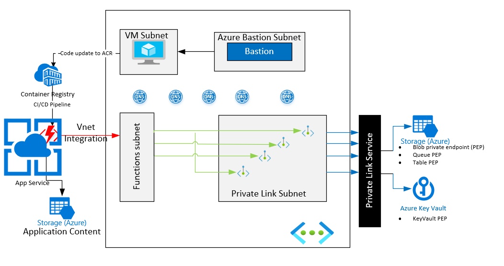

# Func-on-Containers-with-PEP

This sample is meant to illustrate the following.
1. Use of Functions, with functions running inside containers.
2. All external resources, the function interacts with such as Storage, container registry etc are behind Private End Points.
3. Use Azure App Service to host the function containers.
4. Use Azure CLI to perform all of the tasks. Note that all of this can be done from the portal, and as well as using ARM Templates.
5. Use Azure Container Registry as the repo and staging area for the containers containing the Function code and dependencies.
6. From an application perspective all of the various components such as (a) Function App, and the various resources it commmunicates/interacts with such 
   as Storage Blobs, Storage Queues, Storage tables, Azure Container registry, Azure Key Vault, etc are privately accessed using Private End Points.
7. Azure Application itself has a Managed Service identity, which is used to authenticate.

## Key concepts

This sample demonstrates how to configure an Azure Function to work with Azure resources using private endpoints. By using private endpoints, the designated resources are accessible only via the virtual network.

The sample sets up the following Azure resources:

- Multiple Azure Functions using different types of triggers such as HTTPTrigger, BlobTrigger and writing to Blobs, Tables, Queues etc
- Azure Function Premium plan with Virtual Network (VNet) Integration enabled
- Virtual network
- Configuring private endpoints for Azure resources
  - Azure Storage private endpoints
  - Azure Key Vault private endpoint
- Private Azure DNS zones
- Azure VM and Azure Bastion in order to access Azure resources within the virtual network.

### High level architecture

The diagram provide shows a high-level depiction of the sample architecture.


## Prerequisites

The following components are required to run this sample:

- [.NET Core 3.1](https://dotnet.microsoft.com/download/dotnet-core/3.1)
- [Visual Studio Code](https://code.visualstudio.com/)
- [Azure CLI](https://docs.microsoft.com/cli/azure/install-azure-cli?view=azure-cli-latest)
- [Azure Functions Core Tools](https://docs.microsoft.com/azure/azure-functions/functions-run-local)
- [Azure subscription](https://azure.microsoft.com/free/)


### Options

You can use the [Azure Cosmos Emulator](https://docs.microsoft.com/azure/cosmos-db/local-emulator) and [Azure Storage Emulator](https://docs.microsoft.com/azure/storage/common/storage-use-emulator), along with the Azure Functions Core Tools, if you wish to develop and test locally.


# Deploy to Azure using the Azure CLI

Here the Azure CLI approach is emphasized. There are other ways of deploying the same including directly from the portal and usign ARM templates.

**Note** All of the below is recommended to be done from the Bastion VM.
The **AzCLFull-2.sh** contains the majority of the Azure CLI commands used to deploy the sample.
```azurecli
The **main Azure CLI Shell File** that contains all of the Azure CLI commands in its entirety. This should be the fall back in case you 
see yourself wanting to refer back. 
```


## Deploying the azure infrastructure for the sample using Azure CLI

It is best to run the CLI scripts in phases. This is **not necessarily in full strict order, but merely suggestive** and if you find you need to juggle the order, please do so.
Most often a script line will fail to execute, if the environment variables denoted by $(ENVIRONMENT_VARIABLE) 
used in that specific line was not pre-populated with the correct value, prior to the line execution. 

**Set the environment variables** 
```bash
# Please provide your subscription id here
export APP_SUBSCRIPTION_ID=<XXXXXXX-Replace-with-ID-XXXXXX>
# Please provide your unique prefix to make sure that your resources are unique
export APP_PREFIX=funcpoc
# Please provide your region, and make sure the region supports container hosting for Functions.
export LOCATION=EastUS ## (East US 2 does not support using containers for functions)
# Please provide your OS
export IS_LINUX=true
export OS_TYPE=Linux


export APP_PE_DEMO_RG=$APP_PREFIX"-funcdemo-rg"

## VNets
export VNET_PREFIX="10.0."
export DEMO_VNET=$APP_PREFIX"-funcdemo-vnet"
export DEMO_VNET_CIDR=$VNET_PREFIX"0.0/16"
export DEMO_VNET_APP_SUBNET=app_subnet
export DEMO_VNET_APP_SUBNET_CIDR=$VNET_PREFIX"1.0/24"
export DEMO_VNET_PL_SUBNET=pl_subnet
export DEMO_VNET_PL_SUBNET_CIDR=$VNET_PREFIX"2.0/24"

## App/Function related
export DEMO_FUNC_PLAN=$APP_PREFIX"-prem-func-plan"
export DEMO_APP_STORAGE_ACCT=$APP_PREFIX"appstore"
export DEMO_FUNC_STORAGE_ACCT=$APP_PREFIX"fncstore"
export DEMO_FUNC_NAME=$APP_PREFIX"-demofunc-app"
export DEMO_APP_STORAGE_CONFIG="FileStore"
## ACR Name must be unique. 
export DEMO_ACR=$APP_PREFIX"FuncDockerAcr" 

## Bastion VM
export DEMO_APP_VM=devtestvm
export DEMO_APP_VM_ADMIN=azureuser
export DEMO_VM_IMAGE=MicrosoftWindowsServer:WindowsServer:2019-Datacenter:latest
export DEMO_VM_SIZE=Standard_DS2_v2

## Keay Vault 
export DEMO_APP_AKV=$APP_PREFIX"-demo-akv1"
export KV_SECRET_APP_MESSAGE="APP-MESSAGE"
export KV_SECRET_APP_MESSAGE_VALUE="This is a test message for function-on-container-POC"
export KV_SECRET_APP_MESSAGE_VAR="APP_MESSAGE"
export KV_SECRET_APP_KV_NAME_VAR="KV_NAME"

```

**Phase 1**

###### Deploy the Vnets and subnets minus the rest.

``` azurecli
## Azure Login
az login
## Make sure to set correct subscription ID if you have multiple subscriptions
az account set --subscription $APP_SUBSCRIPTION_ID
# Create Resource Group
az group create -l $LOCATION -n $APP_PE_DEMO_RG
# Create VNET and App Service delegated Subnet
az network vnet create -g $APP_PE_DEMO_RG -n $DEMO_VNET --address-prefix $DEMO_VNET_CIDR \
 --subnet-name $DEMO_VNET_APP_SUBNET --subnet-prefix $DEMO_VNET_APP_SUBNET_CIDR
# Create Subnet to create PL, VMs etc.
az network vnet subnet create -g $APP_PE_DEMO_RG --vnet-name $DEMO_VNET -n $DEMO_VNET_PL_SUBNET \
    --address-prefixes $DEMO_VNET_PL_SUBNET_CIDR
```
**Phase 2** 
###### Deploy the VM which will be used as the Bastion Jump host to create the environment and develop, debug and deploy the Function code.

```azurecli
####################################### Create Bastion VM for jumbox ###############################                                       
#                                             - NodeJS
#                                             - VS Code
#                                             - Azure CLI
#                                             - Docker Decktop
#  Windows Server VM. You can also chose to use a Windows 10 or Linux VM for this purpose. 
#  If you do so, make sure to do install all of the Pre-requisites on the VM.
####################################################################################################

az vm create -n $DEMO_APP_VM -g $APP_PE_DEMO_RG --image MicrosoftWindowsServer:WindowsServer:2019-Datacenter:latest \
    --vnet-name $DEMO_VNET --subnet $DEMO_VNET_PL_SUBNET --public-ip-sku Standard --size $DEMO_VM_SIZE --admin-username $DEMO_APP_VM_ADMIN

# Capture public IP of the jump/DNS box. NOTE: if you are rerunning OR restarting the VM, the public IP might change. 
# VNET Address of devtestvm = 10.0.2.7 (example, pls use your own value)
# IPV3 address =  192.168.144.193
# Public IP = 40.87.28.171 (eg, pls use your own)
# Once the VM is installed, deploy the above tools on it. OR better yet deploy a Windows 10 VM with the tools such as
# already present in it, to avoid manually installing.It is your Dev box, install the additional tools you need.
# Install VS Code - https://code.visualstudio.com/download
# Setup Local environment to create Functions - https://docs.microsoft.com/en-us/azure/azure-functions/functions-create-first-azure-function-azure-cli?tabs=bash%2Cbrowser&pivots=programming-language-javascript#configure-your-local-environment
# Connect to this VM using Bastion, when testing.
################ ABOVE: Complete the VM Setup before moving next ######################

```

**Phase 3** 

###### Azure Container Registry(ACR) creation and container deployment into ACR

#### Create the ACR

```azurecli
## Create the ACR with Premium SKU and "admin user" must be enabled. In portal, go to the ACR ->access keys, enable 
## and note down password, and replace them in the lines below.
az acr create --resource-group $APP_PE_DEMO_RG --name $DEMO_ACR --sku Premium ## must use Premium SKU
az acr login --name $DEMO_ACR
ACR-AdminUser=<Your_ACR_ADMIN_USER_NAME>
ACR-AdminPassword=<Your_ACR_ADMIN_PASSWORD>
## export ACR Resource ID ###
export ACR_RESOURCE_ID="/subscriptions/"$APP_SUBSCRIPTION_ID"/resourceGroups/"$APP_PE_DEMO_RG"/providers/Microsoft.ContainerRegistry/registries/"$DEMO_ACR
```

Deploy the various Functions into the Azure Function App and Test. Since this is a container based deployment of Functions, we simply prepare the docker image file and 
push it into the ACR. The Function app is configured to Continusouly deploy (CD) the docker image from ACR.

#### Preparing the container image and Deploy the Azure Function code into ACR

After the Azure resources are deployed , you will need to deploy the multiple Azure Functions to the newly created Azure Function app. You can use the [Azure Functions Core Tools to deploy the function](https://docs.microsoft.com/azure/azure-functions/functions-run-local?tabs=windows%2Ccsharp%2Cbash#publish).
Since this sample uses containers to run the Functions, we use the following ACR commands to upload the SRC and build the 
container image into Azure Container Registry, which then loads it into the Function App on Azure.


```azurecli
####################### BEGIN ACR Build  ##############################
## IMPORTANT: CD to folder where "Dockerfile" lives. Replace folder below with your folder.
cd /mnt/c/Users/gpillai/source/repos/Func-on-Containers-with-PEP
## Login before connection to ACR
az acr login -n $DEMO_ACR  -t
az acr build --image azurefunctionsimage:v1.0.0 -r $DEMO_ACR .
######################## END ACR Build #################################
```

The above creates a TAR file of the docker and application files, and sends it to ACR, which then queues up an ACR Task to build the actual docker image and store it in the Azure Container Registry.

**Phase 4**

Deploy the infrastructure **without** the Private End Points(PEP) and Private DNS Zones. The infrastructure (or environment) is the Storage, Function Plan, Function App.
###### Storage Infrastructure


```azurecli
############### STORAGE ###############
# Create the storage account to be used by all the functions for housekeeping
az storage account create --name $DEMO_FUNC_STORAGE_ACCT --location $LOCATION --resource-group $APP_PE_DEMO_RG --sku Standard_LRS --kind StorageV2

# Create the storage account to be used by the function with storage Blob trigger
az storage account create --name $DEMO_APP_STORAGE_ACCT --location $LOCATION --resource-group $APP_PE_DEMO_RG --sku Standard_LRS --kind StorageV2

##
az storage account show -n $DEMO_APP_STORAGE_ACCT --query networkRuleSet
az storage account update --resource-group $APP_PE_DEMO_RG --name $DEMO_APP_STORAGE_ACCT --default-action Allow
# Create Blob container for trigger 
az storage container create --account-name $DEMO_APP_STORAGE_ACCT --name datafiles --auth-mode login

# Create Table Store Table for results
az storage table create --name FileLogs --account-name $DEMO_APP_STORAGE_ACCT 

```

###### Function Infrastructure

```azcli
############# Function Plan and Function App #######################

# Create Premium Function PLAN with premium SKU P2 based on Linux
az functionapp plan create --resource-group $APP_PE_DEMO_RG --name $DEMO_FUNC_PLAN --location $LOCATION --number-of-workers 1 --sku EP2 --is-linux

## Create the actual Function app within the plan environment based on container image as the hosting choice for the function code.
## Here the runtime is node, function version is "3" and a deployment container is specified.
az functionapp create --name $DEMO_FUNC_NAME --storage-account $DEMO_FUNC_STORAGE_ACCT --resource-group $APP_PE_DEMO_RG \
     --plan $DEMO_FUNC_PLAN --deployment-container-image-name $DEMO_ACR.azurecr.io/azurefunctionsimage:v1.0.0  --runtime node --functions-version 3

## The deployment-container-image-name parameter specifies the image to use for the function app. 
## You can use the "az functionapp config container show" command to view information about the image used for deployment. 
az functionapp config container show --name $DEMO_FUNC_NAME --resource-group $APP_PE_DEMO_RG

## You can also use "the az functionapp config container set" command to deploy from a different image.
## If you need to delete, use the below delete cli call.
## az functionapp plan delete --name $DEMO_FUNC_PLAN --resyource-group $APP_PE_DEMO_RG

# Assign MSI for Premium Function App
# Please save the output and take a note of the ObjecID and save it as $APP_MSI
az functionapp identity assign -g $APP_PE_DEMO_RG -n $DEMO_FUNC_NAME

# Capture identity from output
APP_MSI=$(az webapp show --name $DEMO_FUNC_NAME -g $APP_PE_DEMO_RG --query identity.principalId -o tsv)
export APP_MSI

```


###### Function App Settings
```azcli

# Get the connection string for App Storage Account for trigger
# Create Web App variable
STORAGE_ACCESS_KEY=$(az storage account show-connection-string -g $APP_PE_DEMO_RG -n $DEMO_APP_STORAGE_ACCT --query connectionString -o tsv)

az functionapp config appsettings set -g $APP_PE_DEMO_RG -n $DEMO_FUNC_NAME --settings $KV_SECRET_APP_MESSAGE_VAR="$KV_SECRET_APP_MESSAGE"
az functionapp config appsettings set -g $APP_PE_DEMO_RG -n $DEMO_FUNC_NAME --settings $KV_SECRET_APP_KV_NAME_VAR="$DEMO_APP_AKV"
az functionapp config appsettings set -g $APP_PE_DEMO_RG -n $DEMO_FUNC_NAME --settings $DEMO_APP_STORAGE_CONFIG="$STORAGE_ACCESS_KEY"

# Set Private DNS Zone Settings
## WEBSITE_DNS_SERVER=168.62.129.16 
az functionapp config appsettings set -g $APP_PE_DEMO_RG -n $DEMO_FUNC_NAME --settings "WEBSITE_DNS_SERVER"="168.63.129.16"
az functionapp config appsettings set -g $APP_PE_DEMO_RG -n $DEMO_FUNC_NAME --settings "WEBSITE_VNET_ROUTE_ALL"="1"
```

###### Azure Key Vault
```azurecli
# Create Key Vault
az keyvault create --location $LOCATION --name $DEMO_APP_AKV --resource-group $APP_PE_DEMO_RG --enable-soft-delete true

# Set Key Vault Secrets
# Please  take a note of the Secret Full Path and save it as KV_SECRET_DB_UID_FULLPATH
az keyvault secret set --vault-name $DEMO_APP_AKV --name "$KV_SECRET_APP_MESSAGE" --value "$KV_SECRET_APP_MESSAGE_VALUE"

# Capture the KV URI
# az keyvault show --name $DEMO_APP_KV --resource-group $APP_PE_DEMO_RG
export KV_URI="/subscriptions/"$APP_SUBSCRIPTION_ID"/resourceGroups/"$APP_PE_DEMO_RG"/providers/Microsoft.KeyVault/vaults/"$DEMO_APP_AKV

# Set Policy for Web App to access secrets
az keyvault set-policy -g  $APP_PE_DEMO_RG --name $DEMO_APP_AKV --object-id $APP_MSI --secret-permissions get list --verbose

```


**Test prior to deploying PEP and Private DNS Zones**

Before making the various resources acessible only via PEP, do sanity tests.
 

**Phase 5** 

##### Deploy the Private End Points(Pep) and Private DNS Zones

###### Prepare the VNets and subnets for Private Link
```bash
# Create Private Links
#
# Prepare the Subnet
az network vnet subnet update -g $APP_PE_DEMO_RG -n $DEMO_VNET_PL_SUBNET --vnet-name $DEMO_VNET --disable-private-endpoint-network-policies
az network vnet subnet update -g $APP_PE_DEMO_RG -n $DEMO_VNET_PL_SUBNET --vnet-name $DEMO_VNET --disable-private-link-service-network-policies

```

###### 5.1 ACR - Pep and Dns 
```bash
### Set up PEP and Private DNS Zones for the ACR ####
PRIVATE_ACR_IP=$(az network private-endpoint create -g $APP_PE_DEMO_RG -n funcacrpe --vnet-name $DEMO_VNET --subnet $DEMO_VNET_PL_SUBNET \
    --private-connection-resource-id "$ACR_RESOURCE_ID" --connection-name funcacrpeconn -l $LOCATION --group-id "registry" --query customDnsConfigs[0].ipAddresses[0] -o tsv)

## Obtain the IP addresses for ACR Private EndPoints
NETWORK_INTERFACE_ID=$(az network private-endpoint show --name funcacrpe --resource-group $APP_PE_DEMO_RG --query 'networkInterfaces[0].id' --output tsv)
PRIVATE_IP=$(az resource show --ids $NETWORK_INTERFACE_ID  --query 'properties.ipConfigurations[1].properties.privateIPAddress' --output tsv)
PRIVATE_IP=10.0.2.10 ## "az resource show --ids" had some issues. Used "az network private-endpoint show" and used the output for the two IPs below.
DATA_ENDPOINT_PRIVATE_IP=$(az resource show --ids $NETWORK_INTERFACE_ID --api-version 2019-04-01 --query 'properties.ipConfigurations[0].properties.privateIPAddress' --output tsv)
DATA_ENDPOINT_PRIVATE_IP=10.0.2.9
## ACR Private DNS Zone
export AZUREACR_ZONE=privatelink.azurecr.io
az network private-dns zone create -g $APP_PE_DEMO_RG -n $AZUREACR_ZONE
az network private-dns record-set a create --name $DEMO_ACR --zone-name privatelink.azurecr.io --resource-group $APP_PE_DEMO_RG
az network private-dns record-set a create --name ${DEMO_ACR}.${LOCATION}.data --zone-name privatelink.azurecr.io --resource-group $APP_PE_DEMO_RG
## ACR Private DNS - Records
az network private-dns record-set a add-record --record-set-name $DEMO_ACR --zone-name privatelink.azurecr.io --resource-group $APP_PE_DEMO_RG --ipv4-address $PRIVATE_IP
az network private-dns record-set a add-record --record-set-name ${DEMO_ACR}.${LOCATION}.data --zone-name privatelink.azurecr.io --resource-group $APP_PE_DEMO_RG --ipv4-address $DATA_ENDPOINT_PRIVATE_IP
## ACR Private DNS link
az network private-dns link vnet create -g $APP_PE_DEMO_RG --virtual-network $DEMO_VNET --zone-name $AZUREACR_ZONE --name acrdnsLink --registration-enabled false
#############  END ACR and Private DNS for ACR ############################################
```

###### 5.2 Storage - Pep and Dns

```bash
# Create App Storage Private Links
# Get the Resource ID of the App Storage from the Portal, assign it to APP_STORAGE_RESOURCE_ID and create private link
export APP_STORAGE_RESOURCE_ID="/subscriptions/"$APP_SUBSCRIPTION_ID"/resourceGroups/"$APP_PE_DEMO_RG"/providers/Microsoft.Storage/storageAccounts/"$DEMO_APP_STORAGE_ACCT
PRIVATE_APP_BLOB_IP=$(az network private-endpoint create -g $APP_PE_DEMO_RG -n funcblobpe --vnet-name $DEMO_VNET --subnet $DEMO_VNET_PL_SUBNET \
    --private-connection-resource-id "$APP_STORAGE_RESOURCE_ID" --connection-name funcblobpeconn -l $LOCATION --group-id "blob" --query customDnsConfigs[0].ipAddresses[0] -o tsv)
PRIVATE_APP_TABLE_IP=$(az network private-endpoint create -g $APP_PE_DEMO_RG -n functablepe --vnet-name $DEMO_VNET --subnet $DEMO_VNET_PL_SUBNET \
    --private-connection-resource-id "$APP_STORAGE_RESOURCE_ID" --connection-name functableconn -l $LOCATION --group-id "table" --query customDnsConfigs[0].ipAddresses[0] -o tsv)
PRIVATE_APP_QUEUE_IP=$(az network private-endpoint create -g $APP_PE_DEMO_RG -n funcqueuepe --vnet-name $DEMO_VNET --subnet $DEMO_VNET_PL_SUBNET \
    --private-connection-resource-id "$APP_STORAGE_RESOURCE_ID" --connection-name funcqueueconn -l $LOCATION --group-id "queue" --query customDnsConfigs[0].ipAddresses[0] -o tsv)

```

###### 5.3 AKV - Pep and DNS
```bash

# Create Key Vault Private Link
# Get the Resource ID of the Key Vault from the Portal, assign it to KV_RESOURCE_ID and create private link
PRIVATE_KV_IP=$(az network private-endpoint create -g $APP_PE_DEMO_RG -n kvpe --vnet-name $DEMO_VNET --subnet $DEMO_VNET_PL_SUBNET \
    --private-connection-resource-id "$KV_URI" --connection-name kvpeconn -l $LOCATION --group-id "vault" --query customDnsConfigs[0].ipAddresses[0] -o tsv)

# Private DNS Zones
export AZUREKEYVAULT_ZONE=privatelink.vaultcore.azure.net
az network private-dns zone create -g $APP_PE_DEMO_RG -n $AZUREKEYVAULT_ZONE
az network private-dns record-set a add-record -g $APP_PE_DEMO_RG -z $AZUREKEYVAULT_ZONE -n $DEMO_APP_KV -a $PRIVATE_KV_IP
az network private-dns link vnet create -g $APP_PE_DEMO_RG --virtual-network $DEMO_VNET --zone-name $AZUREKEYVAULT_ZONE --name kvdnsLink --registration-enabled false
```

###### 5.4. Storage (Blob, Table & Queue) - Pep and Dns
```bash
export AZUREBLOB_ZONE=privatelink.blob.core.windows.net
az network private-dns zone create -g $APP_PE_DEMO_RG -n $AZUREBLOB_ZONE
az network private-dns record-set a add-record -g $APP_PE_DEMO_RG -z $AZUREBLOB_ZONE -n $DEMO_APP_STORAGE_ACCT -a $PRIVATE_APP_BLOB_IP
az network private-dns link vnet create -g $APP_PE_DEMO_RG --virtual-network $DEMO_VNET --zone-name $AZUREBLOB_ZONE --name blobdnsLink --registration-enabled false

export AZURETABLE_ZONE=privatelink.table.core.windows.net
az network private-dns zone create -g $APP_PE_DEMO_RG -n $AZURETABLE_ZONE
az network private-dns record-set a add-record -g $APP_PE_DEMO_RG -z $AZURETABLE_ZONE -n $DEMO_APP_STORAGE_ACCT -a $PRIVATE_APP_TABLE_IP
az network private-dns link vnet create -g $APP_PE_DEMO_RG --virtual-network $DEMO_VNET --zone-name $AZURETABLE_ZONE --name tablednsLink --registration-enabled false

export AZUREQUEUE_ZONE=privatelink.queue.core.windows.net
az network private-dns zone create -g $APP_PE_DEMO_RG -n $AZUREQUEUE_ZONE
az network private-dns record-set a add-record -g $APP_PE_DEMO_RG -z $AZUREQUEUE_ZONE -n $DEMO_APP_STORAGE_ACCT -a $PRIVATE_APP_QUEUE_IP
az network private-dns link vnet create -g $APP_PE_DEMO_RG --virtual-network $DEMO_VNET --zone-name $AZUREQUEUE_ZONE --name queuednsLink --registration-enabled false

```
###### 5.5 - Funciton App to VNET Integration
```bash
# Attach Web App to the VNET (VNET integration)
az functionapp vnet-integration add -g $APP_PE_DEMO_RG -n $DEMO_FUNC_NAME --vnet $DEMO_VNET --subnet $DEMO_VNET_APP_SUBNET
# enable virtual network triggers
az resource update -g $APP_PE_DEMO_RG -n $DEMO_FUNC_NAME/config/web --set properties.functionsRuntimeScaleMonitoringEnabled=1 --resource-type Microsoft.Web/sites

# Now restart the webapp
az functionapp restart -g $APP_PE_DEMO_RG -n $DEMO_FUNC_NAME
# ...and verify it still has access to KV

# Get the webapp resource id
az functionapp show -g $APP_PE_DEMO_RG -n $DEMO_FUNC_NAME

export FUNC_APP_RESOURCE_ID="/subscriptions/"$APP_SUBSCRIPTION_ID"/resourceGroups/"$APP_PE_DEMO_RG"/providers/Microsoft.Web/sites/"$DEMO_FUNC_NAME
```
###### - Function App - Pep and DNS
```bash
##################################################################################################
# !!!!!!!!!!!!!!!!!!!!!!!!Stop Here Before Creating the Private Endpoint for Function!!!!!!!!!!!!!
# You should now use Docker push to push the function's code which is now part of the container
# Test the App to make sure that functions are running
##################################################################################################

# Create Web App Private Link
PRIVATE_APP_IP==$(az network private-endpoint create -g $APP_PE_DEMO_RG -n funcpe --vnet-name $DEMO_VNET --subnet $DEMO_VNET_PL_SUBNET \
    --private-connection-resource-id $FUNC_APP_RESOURCE_ID --connection-name funcpeconn -l $LOCATION --group-id "sites" --query customDnsConfigs[0].ipAddresses[0] -o tsv)

export AZUREWEBSITES_ZONE=privatelink.azurewebsites.net
az network private-dns zone create -g $APP_PE_DEMO_RG -n $AZUREWEBSITES_ZONE
az network private-dns record-set a add-record -g $APP_PE_DEMO_RG -z $AZUREWEBSITES_ZONE -n $DEMO_FUNC_NAME -a $PRIVATE_APP_IP
az network private-dns record-set a add-record -g $APP_PE_DEMO_RG -z $AZUREWEBSITES_ZONE -n $DEMO_FUNC_NAME".scm" -a $PRIVATE_APP_IP

# Link zones to VNET
az network private-dns link vnet create -g $APP_PE_DEMO_RG -n funcpe-link -z $AZUREWEBSITES_ZONE -v $DEMO_VNET -e False

az webapp log tail -g $APP_PE_DEMO_RG -n $DEMO_FUNC_NAME
```


### Testing the Functions
**Note** All testing is done from within the Bastion VM.

Connect to the Azure Bastion VM.

#### 1. Testing BlobTrigger
##### KeyConcepts 
This sample demonstrates the function being invoked by a Blob Trigger, and extracting the blob size information. 
Note that both the function app and the Blob are both accesible through the Private end points.

1. Login to the Portal and access the Function's Storage Account. Make sure the Storage Account has a container by name "samples-workitems".
2. Upload a file onto the blob container. 
3. This should have triggered the "BlobTrigger Function".
4. Go to the "Blob Trigger" Function in the portal and open up the "Monitor" pane, shown below.

5. You should now see a successful entry in the logs for a file that was uploaded to Blob processed, as shown below.


#### 2. Testing HttpExample
##### KeyConcepts 
This sample demonstrates the function being invoked by a HTTP Trigger, and the resulting message is posted into an Azure Storage Queue. 


1. Login to the Bastion VM and open the Function App and copy the HTTP Url for the function, as shown below.

2. Paste the URL in a browser outside of the bastion VM. You will see an expected forbidden error as shown below. This is because the Function is not accessible from outside, as the URL cannot be resolved.
   It can only be accessed from within the VNET which has the private DNS zone to resolve the URL

3. Now paste the same URL inside a browser from within the Bastion VM, along with a name parameter. 
4. You will get a successful trigger as shown below.

5. The message also gets written to the storage Queue as shown below.


#### 3. Testing FileLogger  
##### KeyConcepts 
This sample demonstrates the function responding to a File uploaded to the Blob, and invokes the function(inward binding). The meta data is parsed and written to the Storage Table (out-binding)

1. Login to the Bastion VM.
2. Copy the `sample.csv` file to the newly created VM
3. From the VM, use a web browser to open the Azure portal.
4. Navigate to the application storage account which starts with (this is the one set to the 'FileStore' in the Function app's settings.  Using Storage Explorer in the portal, upload the `sample.csv` file to the `datafiles` blob storage container.
5. Within a few seconds, the function's [blog trigger](https://docs.microsoft.com/en-us/azure/azure-functions/functions-bindings-storage-blob-trigger?tabs=javascript) should execute and process the file.
6. Navigate to table 'FileLogs' of the same storage account.You should notice similar output to one shown below, depending on the file you uploaded to the blob.


#### 4. Testing AkvGetSecret 
##### KeyConcepts 
This sample demonstrates a Function app fetching Key Vault Secrets. 
1. Login to the Bastion VM.
2. Go to the AkvGetSecret Function and copy its URL.

3. To the above URL append the Function Key needed to be appended. This is obtained from the "Function Key" tab as shown below. 

4. The URL from #2 will be appended with the "**code=**" being the Key and "**name**" being a parameter to (Http)trigger the Function.
5. The URL will look something like the below.
https://attfunctest-demofunc-app.azurewebsites.net/api/GetAkvSecret?code=/DI7RmplDZC1qgAdB68hYDb5W9yTYQk8XzMv4wdKNzaK2DXwqXishA==&name=HelloAKV
6. Paste the URL into the browser.You should now be able to see the secret retrieved from the Azure Key Vault as shown below.


### Storage accounts

Azure Functions [requires the use of a general-purpose storage account](https://docs.microsoft.com/azure/azure-functions/storage-considerations#storage-account-requirements).  This sample uses two storage accounts to meet that requirement.

- The "Application" storage account referenced by the "FileStore" application setting is configured with a private endpoint.
- The storage account referenced by the [WEBSITE_CONTENTAZUREFILECONNECTIONSTRING](https://docs.microsoft.com/azure/azure-functions/functions-app-settings#website_contentazurefileconnectionstring) does not use a private endpoint.

### Access resources with VNet restrictions

The sample provisions nearly all Azure resources within the confines of a virtual network.  Attempts to access the following resources will only succeed from within the VM (which is itself within the virtual network) due to the virtual network restrictions on the resources:


## Contents

Outline the file contents of the repository. It helps users navigate the codebase, build configuration and any related assets.

| File/folder       | Description                                |
|-------------------|--------------------------------------------|
| `.vscode`         | VS Code related settings.                  |
| `src`             | Sample source code.                        |
| `src\BlobTrigger`             | Azure Function sample using BlobTrigger                        |
| `src\FileLogger`             | Sample showing Uploaded File data getting inserted into Table                         |
| `src\GetAkvSecret`             | Sample showing fetching Azure Key Vault secrets                         |
| `src\HttpExample`             | Http Trigger to write messages into a Queue                         |
| `**AzCLFull-2.sh**`  | The **main Azure CLI Shell File** used to run the deployment of the sample
| `.gitignore`      | Define what to ignore at commit time.      |
| `CHANGELOG.md`    | List of changes to the sample.             |
| `CONTRIBUTING.md` | Guidelines for contributing to the sample. |
| `README.md`       | This README file.                          |
| `LICENSE`         | The license for the sample.                |


## Some Useful Links
The following links may be useful to read as you go about setting this application up:

How to use Azure Managed Service Identity (public preview) in App Servce and Azure Functions

## Contributing

This project welcomes contributions and suggestions.  Most contributions require you to agree to a
Contributor License Agreement (CLA) declaring that you have the right to, and actually do, grant us
the rights to use your contribution. For details, visit [https://cla.opensource.microsoft.com](https://cla.opensource.microsoft.com).

When you submit a pull request, a CLA bot will automatically determine whether you need to provide
a CLA and decorate the PR appropriately (e.g., status check, comment). Simply follow the instructions
provided by the bot. You will only need to do this once across all repos using our CLA.

This project has adopted the [Microsoft Open Source Code of Conduct](https://opensource.microsoft.com/codeofconduct/).
For more information see the [Code of Conduct FAQ](https://opensource.microsoft.com/codeofconduct/faq/) or
contact [opencode@microsoft.com](mailto:opencode@microsoft.com) with any additional questions or comments.
"# Func-on-Containers-with-PEP" 

